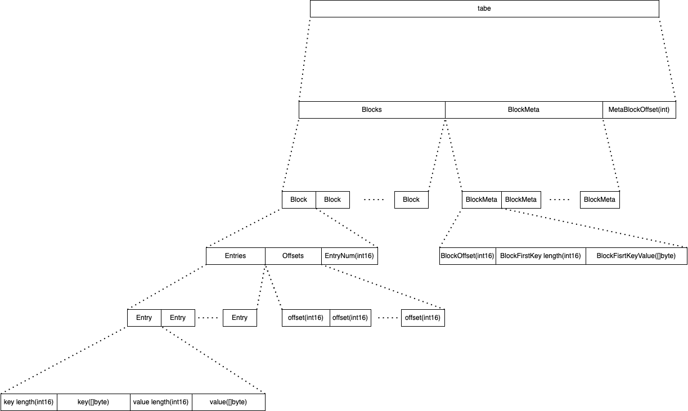

# lsm-storage
implement persistence storage based [lsm-tree](https://en.wikipedia.org/wiki/Log-structured_merge-tree)


# Example

```bash
go get github.com/ISSuh/lsm-tree
```

```go

import github.com/ISSuh/lsm-tree/storage

storageOption := storage.NewOption()
storageOption.Path = "./temp"

storage: storage.NewStorage(storageOption),

key := "user1"
value := []byte("test")
storage.Set(key, value)


getValue := handler.Get(key)
if getValue == nil {
  return error
}

storage.Remove(key)
```

# Data Layout 
